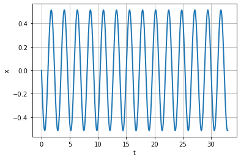
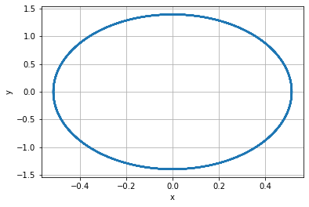
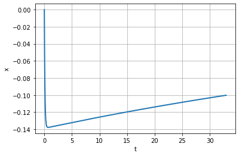
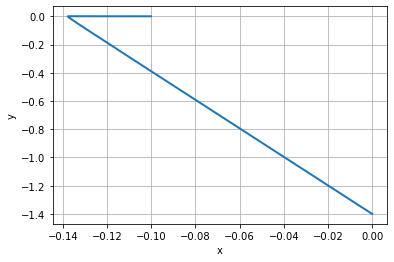
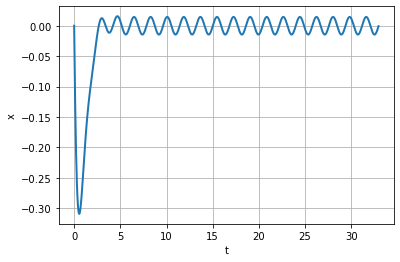
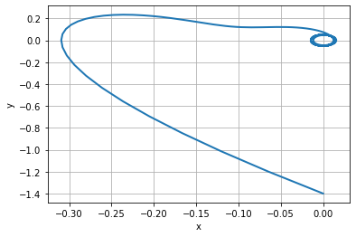

Содержание {#содержание .TOC-Heading}
==========

[Цель работы 1](#цель-работы)

[Задание 1](#задание)

[Теоретическое введение](#теоретическое-введение)

[Выполнение лабораторной работы 2](#выполнение-лабораторной-работы)

[Выводы](#_Toc65186462)

17Ответы на вопросы к лабораторной
работе................................................................7

Цель работы
===========

> Ознакомление с моделью линейного гармонического осциллятора и ее
> построение с помощью языка программирования Python.

Задание
=======

Построить фазовый портрет гармонического осциллятора и решить уравнения
гармонического осциллятора для следующих случаев:

1.  Колебания гармонического осциллятора без затуханий и без действий
    внешней силы $\overset{¨}{x} + 7.4x = 0$

```{=html}
<!-- -->
```
1.  Колебания гармонического осциллятора c затуханием и без действий
    внешней силы $\overset{¨}{x} + 10.1\overset{˙}{x} + 0.1x = 0$

2.  Колебания гармонического осциллятора c затуханием и под действием
    внешней силы
    $\overset{¨}{x} + 3\overset{˙}{x} + 3.3x = 0.2\sin\left( 3.5t \right)$

На интервале $t \in \left\lbrack 0;33 \right\rbrack$(шаг 0.05) с
начальными условиями $x_{0} = 0,y_{0} = - 1.4$

Теоретическое введение
======================

Уравнение свободных колебаний гармонического осциллятора имеет следующий
вид:

$\overset{¨}{x} + 2\gamma\overset{˙}{x} + \omega_{0}^{2}x = f\left( t \right)$

$x$ --- переменная

$t$ --- время

$\omega_{0}$ --- частота колебаний

$\gamma$ --- параметр, характеризующий потери энергии

В свою очередь:

$\overset{¨}{x} = \frac{\partial^{2}x}{\partial t^{2}},\overset{˙}{x} = \frac{\partial x}{\partial t}$

Выполнение лабораторной работы
==============================

Данную лабораторную работу я выполняла на языке программирования Python
. Ниже представлен программный код для первого случая: колебания
гармонического осциллятора без затуханий и без действий внешней силы

import numpy as np

from scipy. integrate import odeint

import matplotlib.pyplot as plt

import math

w2 = 7.4

tmax = 33

step = 0.05

y0 = \[0, -1.4\]

def W(y, t):

y1, y2 = y

return \[y2, -w2\*y1 \]

t = np.arange( 0, tmax, step)

w1 = odeint(W, y0, t)

y11 = w1\[:,0\]

y21 = w1\[:,1\]

fig = plt.figure(facecolor=\'white\')

plt.plot(t, y11, linewidth=2)

plt.ylabel(\"x\")

plt.xlabel(\"t\")

plt.grid(True)

plt.show()

fig.savefig(\'1.png\', dpi = 600)

fig2 = plt.figure(facecolor=\'white\')

plt.plot(y11, y21, linewidth=2)

plt.ylabel(\"y\")

plt.xlabel(\"x\")

plt.grid(True)

plt.show()

fig2.savefig(\'2.png\', dpi = 600)

{width="5.471527777777778in"
height="3.6381944444444443in"}

Figure 1: График решения для случая 1

{width="5.471527777777778in"
height="3.6659722222222224in"}

Figure 2: Фазовый портрет для случая 1

Программный код для второго случая: колебания гармонического осциллятора
c затуханием и без действий внешней силы

w2 = 0.1

g = 10.1

def W(y, t):

y1, y2 = y

return \[y2, -w2\*y1 - g\*y2 \]

t = np.arange( 0, tmax, step)

w1 = odeint(W, y0, t)

y11 = w1\[:,0\]

y21 = w1\[:,1\]

fig = plt.figure(facecolor=\'white\')

plt.plot(t, y11, linewidth=2)

plt.ylabel(\"x\")

plt.xlabel(\"t\")

plt.grid(True)

plt.show()

fig.savefig(\'3.png\', dpi = 600)

fig2 = plt.figure(facecolor=\'white\')

plt.plot(y11, y21, linewidth=2)

plt.ylabel(\"y\")

plt.xlabel(\"x\")

plt.grid(True)

plt.show()

fig2.savefig(\'4.png\', dpi = 600)



Figure 3: График решения для случая 2



Figure 4: Фазовый портрет для случая 2

Программный код для третьего случая: колебания гармонического
осциллятора c затуханием и под действием внешней силы был написан
следующий код

w2 = 3.3

g = 3

def f(t):

f = 0.2\*math.sin(3.5\*t)

return f

def W(y, t):

y1, y2 = y

return \[y2, -w2\*y1 - g\*y2 + f(t) \]

t = np.arange( 0, tmax, step)

w1 = odeint(W, y0, t)

y11 = w1\[:,0\]

y21 = w1\[:,1\]

fig = plt.figure(facecolor=\'white\')

plt.plot(t, y11, linewidth=2)

plt.ylabel(\"x\")

plt.xlabel(\"t\")

plt.grid(True)

plt.show()

fig.savefig(\'5.png\', dpi = 600)

fig2 = plt.figure(facecolor=\'white\')

plt.plot(y11, y21, linewidth=2)

plt.ylabel(\"y\")

plt.xlabel(\"x\")

plt.grid(True)

plt.show()

ig2.savefig(\'6.png\', dpi = 600)

f

Figure 5: График решения для случая 3



Figure 6: Фазовый портрет для случая 3

Выводы
======

При выполнении данной лабораторной работы я познакомилась с моделью
гармонических коллебаний, научилась выводить ДУ, а также построила
фазовый портрет гармонического осциллятора, решила уравнения
гармонического осциллятора:

1.  Колебания гармонического осциллятора без затуханий и без действий
    внешней силы.

2.  Колебания гармонического осциллятора c затуханием и без действий
    внешней силы.

3.  Колебания гармонического осциллятора c затуханием и под действием
    внешней силы.

Ответы на вопросы к лабораторной работе
=======================================

**1.Запишите простейшую модель гармонических колебаний**

Гармони́ческий осцилля́тор** **

$F = - \text{kx}$

**2. Определение осциллятора :** система, совершающая колебания, то есть
показатели которой периодически повторяются во времени

**3. Модель математического маятника :** Колебания математического
маятника описываются обыкновенным дифференциальным уравнением (ДУ) вида

**Ẍ +** ω2 sin(x) = 0

4.**Aлгоритм перехода от дифференциального уравнения второго порядка**

к двум дифференциальным уравнениям первого порядка

-Уравнения второго порядка с отсутствующей зависимой переменной
например:

Этот тип уравнения второго порядка легко сводится к уравнению первого
порядка с помощью преобразования ỳ = w , Эта замена, очевидно,
подразумевает y ″ = w ′

и исходное уравнение становится уравнением первого порядка для w. Решить
для функции w; затем интегрировать его, чтобы восстановить у.

**5.фазовый портрет и фазовая траектория**

-Фазовый портрет колебательной системы или процесса -- это

совокупность реализующихся фазовых траекторий.

Фазовая траектория -- это линия изменения состояния в фазовом
пространстве.

\*фазовая траектория гармонического осциллятора в отсутствие сил трения
представляет собой замкнутую кривую второго порядка. В частном случае
это может быть окружность.
