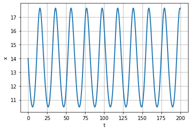

Лабораторная работа №5

Альсид Мона

NEC--2021, 12 March, Moscow, Russian Federation

-   RUDN University, Moscow, Russian Federation

> Модель хищник-жертва

**Цель лабораторной работы**

-   Изучение модель хищник-жертва и построение графики с помощью языка
    > программирования Python

**Задание к лабораторной работе**

1\. Построить график зависимости x от y и графики

функций x(t) , y(t)

2\. Найти стационарное состояние системы

Условие задачи

Для модели «хищник-жертва»:

$\begin{Bmatrix}
\frac{\text{dx}}{\text{dt}} = \left( - 0\text{.}\text{29}x\left( t \right) + 0\text{.}\text{031}y\left( t \right)x\left( t \right) \right) \\
\frac{\text{dy}}{\text{dt}} = \left( 0\text{.}\text{33}y\left( t \right) - 0\text{.}\text{024}y\left( t \right)x\left( t \right) \right) \\
\end{Bmatrix}$

> Построить график зависимости численности хищников от численности
> жертв, а также графики изменения численности хищников и численности
> жертв при следующих начальных условиях:
> $x_{0} = 7\text{,y}_{0} = \text{14}$
>
> Найти стационарное состояние системы

**График изменения численности хищников**

Figure 1: График численности хищников от времени

Figure 2: График численности жертв от времени

**График зависимости численности хищников от численности жертв**

Figure 3: График численности хищников от численности жертв

В ходе выполнения лабораторной работы была изучена

модель хищник-жертва и построены графики.
