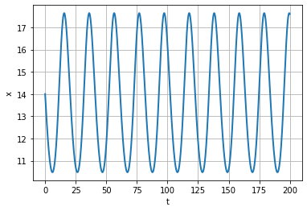
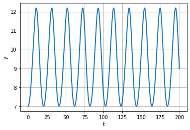
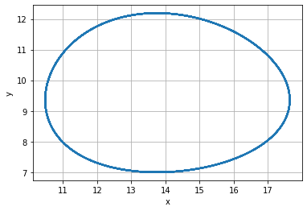

Содержание {#содержание .TOC-Heading}
==========

1\. Цель
работы...........................................................\...3

2\.
Задание...........................................................................\...3

3\. Выполнение лабораторной работы.............4

4\.
Выводы..............................................................................\...6

1 Цель работы
=============

Изучить модель хищник-жертва

2 Задание
=========

1.  Построить график зависимости $x$ от $y$ и графики функций
    $x\left( t \right)$, $y\left( t \right)$

```{=html}
<!-- -->
```
1.  Найти стационарное состояние системы

3 Выполнение лабораторной работы
================================

В данной лабораторной работе рассматривается математическая модель
системы «Хищник-жертва».

Задача
------

Для модели «хищник-жертва»:

$\left\{ \begin{matrix}
\frac{dx}{dt} = \left( - 0.29x\left( t \right) + 0.031y\left( t \right)x\left( t \right) \right) \\
\frac{dy}{dt} = \left( 0.33y\left( t \right) - 0.024y\left( t \right)x\left( t \right) \right) \\
\end{matrix} \right.\ $

Постройте график зависимости численности хищников от численности жертв,
а также графики изменения численности хищников и численности жертв при
следующих начальных условиях: $x_{0} = 7,y_{0} = 14$ Найдите
стационарное состояние системы

    import numpy as np
    from scipy. integrate import odeint
    import matplotlib.pyplot as plt
    import math

    a = 0.29
    b = 0.031
    c = 0.33
    d = 0.024

    y0 = [14, 7]

    def syst2(y, t):
        y1, y2 = y
        return [-a*y1 + b*y1*y2, c*y2 - d*y1*y2 ]

    t = np.arange( 0, 200, 0.1)
    y = odeint(syst2, y0, t)
    y11 = y[:,0]
    y21 = y[:,1]

    fig = plt.figure(facecolor='white')
    plt.plot(t, y11, linewidth=2)
    plt.ylabel("x")
    plt.xlabel("t")
    plt.grid(True)
    plt.show()
    fig.savefig('1.png', dpi = 600)

    fig2 = plt.figure(facecolor='white')
    plt.plot(t, y21, linewidth=2)
    plt.ylabel("y")
    plt.xlabel("t")
    plt.grid(True)
    plt.show()
    fig2.savefig('2.png', dpi = 600)

    fig3 = plt.figure(facecolor='white')
    plt.plot(y11, y21, linewidth=2)
    plt.ylabel("y")
    plt.xlabel("x")
    plt.grid(True)
    plt.show()
    fig3.savefig('3.png', dpi = 600)

    print("Xст = ", a/b)
    print("Yст = ", c/d)



Figure 1: График численности хищников от времени

{width="5.304861111111111in"
height="3.6381944444444443in"}

Figure 2: График численности жертв от времени



Figure 3: График численности хищников от численности жертв

Стационарное состояние $x_{0} = 9.3548,y_{0} = 13.75$

4 Выводы
========

В ходе выполнения лабораторной работы была изучена модель хищник-жертва
и построены графики.
