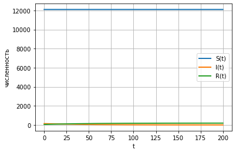

Лабораторная работа №6

Альсид Мона

NEC--2021, 20 March, Moscow, Russian Federation

-   RUDN University, Moscow, Russian Federation

> Задача об эпидемии

**Цель лабораторной работы**

-   Изучить модель эпидемии SIR

**Задание к лабораторной работе**

1\. Изучить модель эпидемии

функций x(t) , y(t)

2\. Построить графики изменения числа особей в каждой из трех групп.
Рассмотреть, как будет протекать эпидемия в случае: I(0) ≤ I^\*^ , I(0)
\> I^\*^

Условие задачи

На одном острове вспыхнула эпидемия. Известно, что из все проживающих

на острове (N=12 400) в момент начала эпидемии (t=0) число заболевших

людей (являющихся распространителями инфекции) I(0)=150, А число

здоровых людей с иммунитетом к болезни R(0)=55. Таким образом, число

людей восприимчивых к болезни, но пока здоровых, в начальный момент

времени S(0)=N-I(0)- R(0).

Постройте графики изменения числа особей в каждой из трех групп.

Рассмотрите, как будет протекать эпидемия в случае:

1\) если I (0)≤ I^\*^

2\) если I (0)\> I\*

**Графики изменения численности в первом случае**

**Figure 1: График численности групп**

**Figure 2: График численности групп**

**Выводы**

**В ходе выполнения лабораторной работы была изучена**

**модель SIR и построены графики .**
