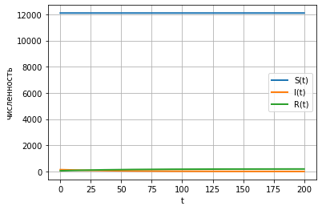
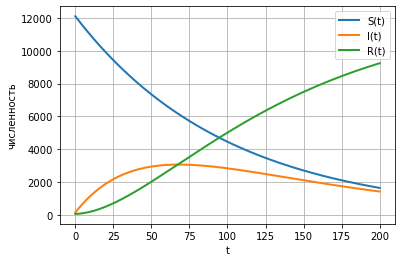

**Отчет по лабораторной работе №6**

**Модель эпидемии - вариант 35**

**Альсид Мона  НФИбд-03-18**

**Содержание**

**1.** Цель работы
.....................................................................**\...3**

2\.
Задание...............................................................................**3**

3\. Выполнение лабораторной
работы..............................................4

4\.
Выводы..............................................................................\...6

1 Цель работы
=============

Изучить модель эпидемии $SIR$

2 Задание
=========

1.  Изучить модель эпидемии

```{=html}
<!-- -->
```
1.  Построить графики изменения числа особей в каждой из трех групп.
    Рассмотреть, как будет протекать эпидемия в случае:
    $I\left( 0 \right) \leq I^{}$, $I\left( 0 \right) > I^{}$

3 Выполнение лабораторной работы
================================

3.1 Теоретические сведения
--------------------------

скорость изменения числа $S\left( t \right)$ меняется по следующему
закону:

$\frac{dS}{dt} = \left\{ \begin{matrix}
 - \alpha S & \text{,если}I\left( t \right) > I^{} \\
0 & \text{,если}I\left( t \right) \leq I^{} \\
\end{matrix} \right.\ $

Постоянные пропорциональности $\alpha,\beta$ - это коэффициенты
заболеваемости и выздоровления соответственно. Для того, чтобы решения
соответствующих уравнений определялось однозначно, необходимо задать
начальные условия. Считаем, что на начало эпидемии в момент времени
$t = 0$ нет особей с иммунитетом к болезни $R\left( 0 \right) = 0$, а
число инфицированных и восприимчивых к болезни особей
$I\left( 0 \right)$ и $S\left( 0 \right)$ соответственно. Для анализа
картины протекания эпидемии необходимо рассмотреть два случая:
$I\left( 0 \right) \leq I^{}$ и $I\left( 0 \right) > I^{}$

3.2 Задача
----------

На одном острове вспыхнула эпидемия. Известно, что из всех проживающих
на острове $\left( N = 12300 \right)$ в момент начала эпидемии
$\left( t = 0 \right)$ число заболевших людей (являющихся
распространителями инфекции) $I\left( 0 \right) = 140$, А число здоровых
людей с иммунитетом к болезни $R\left( 0 \right) = 54$. Таким образом,
число людей восприимчивых к болезни, но пока здоровых, в начальный
момент времени
$S\left( 0 \right) = N - I\left( 0 \right) - R\left( 0 \right)$.
Постройте графики изменения числа особей в каждой из трех групп.
Рассмотрите, как будет протекать эпидемия в случае: 1.
$I\left( 0 \right) \leq I^{}$ 2. $I\left( 0 \right) > I^{}$

    import numpy as np
    from scipy. integrate import odeint
    import matplotlib.pyplot as plt
    import math

    N = 12300
    I0 = 140
    R0 = 54
    S0 = N-I0-R0

    a = 0.01
    b = 0.02

    x0 = [S0, I0, R0]

    def syst(y, t):
        y1, y2, y3 = y
        return [0, -b*y2, b*y2 ]


    def syst2(y, t):
        y1, y2, y3 = y
        return [-a*y1, a*y1-b*y2, b*y2 ]

    t = np.arange( 0, 200, 0.01)
    y1 = odeint(syst, x0, t)
    y1s = y1[:,0]
    y1i = y1[:,1]
    y1r = y1[:,2]

    fig = plt.figure(facecolor='white')
    plt.plot(t, y1s, linewidth=2, label='S(t)')
    plt.plot(t, y1i, linewidth=2, label='I(t)')
    plt.plot(t, y1r, linewidth=2, label='R(t)')
    plt.ylabel("численность")
    plt.xlabel("t")
    plt.grid(True)
    plt.legend()
    plt.show()
    fig.savefig('1.png', dpi = 600)


    y2 = odeint(syst2, x0, t)
    y2s = y2[:,0]
    y2i = y2[:,1]
    y2r = y2[:,2]

    fig2 = plt.figure(facecolor='white')
    plt.plot(t, y2s, linewidth=2, label='S(t)')
    plt.plot(t, y2i, linewidth=2, label='I(t)')
    plt.plot(t, y2r, linewidth=2, label='R(t)')
    plt.ylabel("численность")
    plt.xlabel("t")
    plt.grid(True)
    plt.legend()
    plt.show()
    fig2.savefig('2.png', dpi = 600)



Figure 1: Графики численности в случае $I\left( 0 \right) \leq I^{}$



Figure 2: Графики численности в случае $I\left( 0 \right) > I^{}$

4 Выводы
========

В ходе выполнения лабораторной работы была изучена модель эпидемии и
построены графики.
