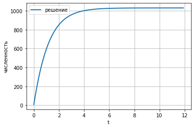
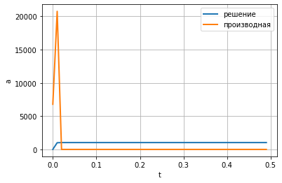
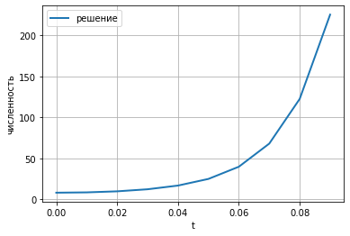

Лабораторная работа №7

Альсид Мона

NEC--2021, 26 March, Moscow, Russian Federation

-   RUDN University, Moscow, Russian Federation

> Модель распространения рекламы

**Цель лабораторной работы**

-   Изучить модель эффективности рекламы

**Задание к лабораторной работе**

1\. Изучить модель эфеективности рекламы

2\. Построить графики распространения рекламы в заданных случайх

3\. Определить для случая 2 момент времени, в который

скорость распространения рекламы будет максимальной

Условие задачи

Постройте график распространения рекламы, математическая модель которой
описывается следующим уравнением:

1.  $\frac{dn}{dt} = \left( 0.83 + 0.000083n\left( t \right) \right)\left( N - n\left( t \right) \right)$

```{=html}
<!-- -->
```
1.  $\frac{dn}{dt} = \left( 0.000083 + 0.83n\left( t \right) \right)\left( N - n\left( t \right) \right)$
2.  $\frac{dn}{dt} = \left( 0.83\text{sin}\left( t \right) + 0.83\text{sin}\left( t \right)n\left( t \right) \right)\left( N - n\left( t \right) \right)$

При этом объем аудитории $N = 1030$, в начальный момент о товаре знает 8
человек.

Для случая 2 определите в какой момент времени скорость распространения
рекламы будет иметь максимальное значение.

**График в первом случае**



**Figure 1: График для случая 1**


**Figure 2: График для случая 2**

максимальная скорость распространения при t = 0.09

**График в третьем случае**



Figure 3: График для случая 3

В ходе выполнения лабораторной работы была изучена

модель эффективности рекламы и построены графики.
