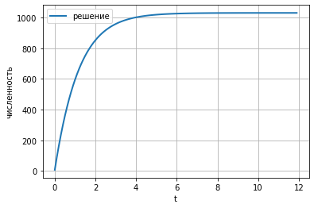
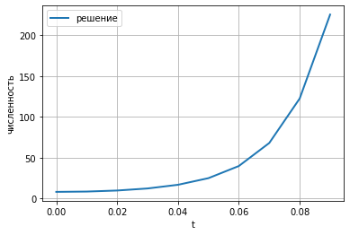

**Содержание**

1\. Цель
работы..........................................................

2\.
Задание................................................................

3\. Выполнение лабораторной работы..............................

4\.
Выводы................................................................

1 Цель работы 
=============

Изучить модель эффективности рекламы

2 Задание
=========

1.  Изучить модель эфеективности рекламы

```{=html}
<!-- -->
```
1.  Построить графики распространения рекламы в заданных случайх
2.  Определить для случая 2 момент времени, в который скорость
    распространения рекламы будет максимальной

3 Выполнение лабораторной работы
================================

3.2 Задача
----------

Постройте график распространения рекламы, математическая модель которой
описывается следующим уравнением:

1.  $\frac{dn}{dt} = \left( 0.83 + 0.000083n\left( t \right) \right)\left( N - n\left( t \right) \right)$
2.  $\frac{dn}{dt} = \left( 0.000083 + 0.83n\left( t \right) \right)\left( N - n\left( t \right) \right)$
3.  $\frac{dn}{dt} = \left( 0.83\text{sin}\left( t \right) + 0.83\text{sin}\left( t \right)n\left( t \right) \right)\left( N - n\left( t \right) \right)$

При этом объем аудитории $N = 1030$, в начальный момент о товаре знает 8
человек.

Для случая 2 определите в какой момент времени скорость распространения
рекламы будет иметь максимальное значение.

    import numpy as np
    from scipy. integrate import odeint
    import matplotlib.pyplot as plt
    import math

    t0 = 0
    x0 = 8
    N = 1030

    a1 = 0.83
    a2 = 0.000083

    t = np.arange( t0, 12, 0.1)

    def syst(dx, t):
        x = dx
        return (a1 +x*a2)*(N-x)


    y = odeint(syst, x0, t)

    fig1 = plt.figure(facecolor='white')
    plt.plot(t, y, linewidth=2, label="решение")
    plt.xlabel("t")
    plt.ylabel("численность")
    plt.grid(True)
    plt.legend()
    plt.show()
    fig1.savefig('1.png', dpi = 600)

    a1 = 0.000083
    a2 = 0.83

    t = np.arange( t0, 0.5, 0.01)

    y = odeint(syst, x0, t)
    dy = (a1 +y*a2)*(N-y)

    fig2 = plt.figure(facecolor='white')
    plt.plot(t, y, linewidth=2, label="решение")
    plt.plot(t, dy, linewidth=2, label="производная")
    plt.xlabel("t")
    plt.ylabel("численность")
    plt.grid(True)
    plt.legend()
    plt.show()
    fig2.savefig('2.png', dpi = 600)

    def a1(t): 
        a1 = 0.83*math.sin(t)
        return a1

    def a2(t): 
        a2 = 0.83*math.sin(t)
        return a2

    t = np.arange( t0, 0.1, 0.01)

    def syst2(dx, t):
        x = dx
        return (a1(t) +x*a2(t))*(N-x)

    y = odeint(syst2, x0, t)

    fig3 = plt.figure(facecolor='white')
    plt.plot(t, y, linewidth=2, label="решение")
    plt.xlabel("t")
    plt.ylabel("численность")
    plt.grid(True)
    plt.legend()
    plt.show()
    fig3.savefig('3.png', dpi = 600)



Figure 1: График для случая 1


Figure 2: График для случая 2

максимальная скорость распространения достигается при $t = 0.09$



Figure 3: График для случая 3

4 Выводы
========

В ходе выполнения лабораторной работы была изучена модель эффективности
рекламы и построены графики.
