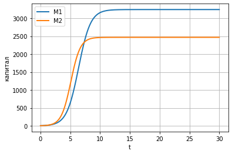
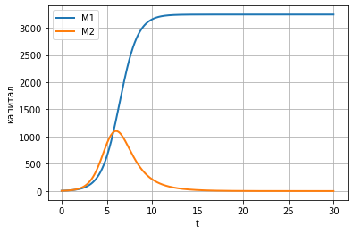

Лабораторная работа №8

Альсид Мона

МатМод--2021, 2 April Moscow, Russian Federation

-   RUDN University, Moscow, Russian Federation

> **Модель конкуренции двух фирм**

**Цель лабораторной работы**

-   Изучить модель конкуренции

**Задание к лабораторной работе**

1\. Изучить модель конкуренции двух фирм

2\. Построить графики изменения оборотных средств в

двух случаях

**Условие задачи**

**Случай 1**

Рассмотрим две фирмы, производящие взаимозаменяемые товары одинакового
качества и находящиеся в одной рыночной нише. Будем считать, что
постоянные издержки пренебрежимо малы.

$\frac{dM_{1}}{d\Theta} = M_{1} - \frac{b}{c_{1}}M_{1}M_{2} - \frac{a1}{c1}M_{1}^{2}$

$\frac{dM_{2}}{d\Theta} = \frac{c_{2}}{c_{1}}M_{2} - \frac{b}{c_{1}}M_{1}M_{2} - \frac{a_{2}}{c_{1}}M_{2}^{2}$

**Случай 2**

Рассмотрим модель, когда, помимо экономического фактора влияния
используются еще и социально-психологические факторы.

$\frac{dM_{1}}{d\Theta} = M_{1} - \left( \frac{b}{c_{1}} + 0.00053 \right)M_{1}M_{2} - \frac{a1}{c1}M_{1}^{2}$

$\frac{dM_{2}}{d\Theta} = \frac{c_{2}}{c_{1}}M_{2} - \frac{b}{c_{1}}M_{1}M_{2} - \frac{a_{2}}{c_{1}}M_{2}^{2}$

$a_{1} = \frac{p_{cr}}{\tau_{1}^{2}{\overset{\sim}{p}}_{1}^{2}Nq}$

$a_{2} = \frac{p_{cr}}{\tau_{2}^{2}{\overset{\sim}{p}}_{2}^{2}Nq}$

$b = \frac{p_{cr}}{\tau_{1}^{2}{\overset{\sim}{p}}_{1}^{2}\tau_{2}^{2}{\overset{\sim}{p}}_{2}^{2}Nq}$

$c_{1} = \frac{p_{cr} - {\overset{\sim}{p}}_{1}}{\tau_{1}{\overset{\sim}{p}}_{1}}$

$c_{2} = \frac{p_{cr} - {\overset{\sim}{p}}_{2}}{\tau_{2}{\overset{\sim}{p}}_{2}}$

$M_{0}^{1} = 5.4M_{0}^{2} = 4.1$

$p_{cr} = 35N = 30q = 1$

$\tau_{1} = 18\tau_{2} = 13$

${\overset{\sim}{p}}_{1} = 7.7{\overset{\sim}{p}}_{2} = 8.3$

{width="2.4895833333333335in"
height="1.6513888888888888in"}

**Figure 1: График для случая 1**

**Figure 2: График для случая 2**

В ходе выполнения лабораторной работы была изучена

модель конкуренции двух фирм и построены графики.
